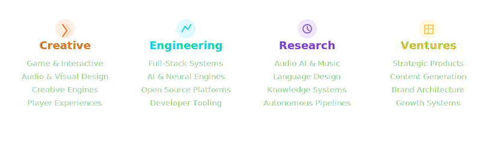
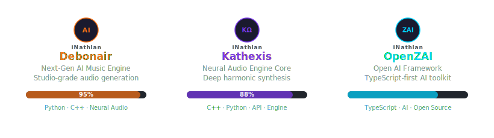
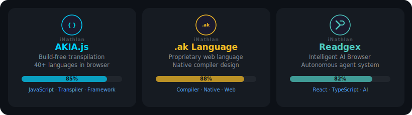
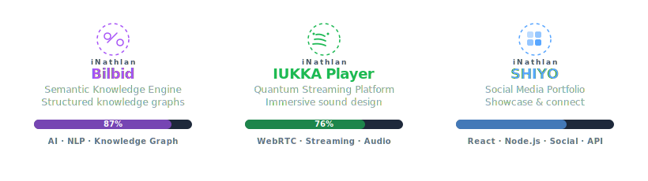
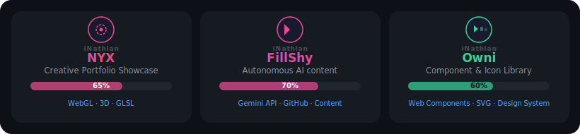
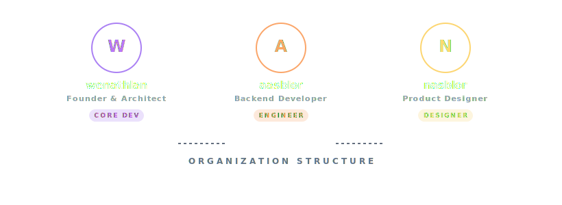
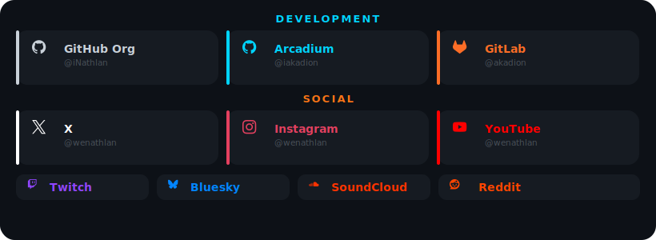

  
   
  
    
  &nbsp;&nbsp;
  &nbsp;&nbsp;
  &nbsp;&nbsp;
  &nbsp;&nbsp;
  &nbsp;&nbsp;
  &nbsp;&nbsp;
  &nbsp;&nbsp;
  &nbsp;&nbsp;
  

 

<h3>✦ WHO WE ARE ✦</h3>

 

<h3>✦ STATUS ✦</h3>

 

 

<h3>✦ TECH STACK ✦</h3>

 

 

<h3>✦ PROJECTS ✦</h3>

 

 

 

 

 

 

 

<h3>✦ TEAM ✦</h3>

 

 

<h3>✦ CONNECT ✦</h3>

 

 

<h3>✦ GITHUB STATS ✦</h3>

 

 

 

<h3>✦ CONTRIBUTIONS ✦</h3>

 

  

<h3>✦ AWARDS ✦</h3>

 

  

